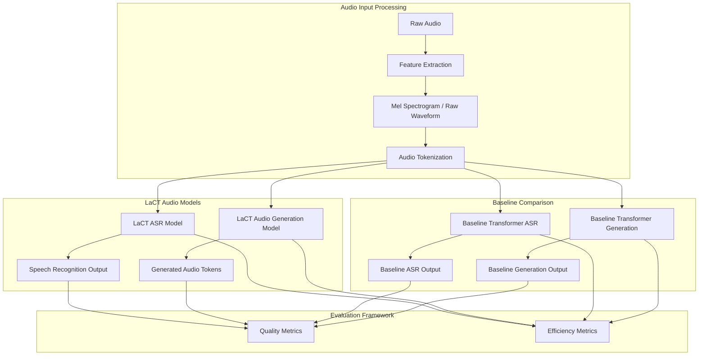

# Design Document

## Overview

This research project implements Long Chunk Test-Time Training (LaCT) for audio applications, focusing on Automatic Speech Recognition (ASR) and audio generation. The design leverages the core LaCT architecture with audio-specific adaptations to handle temporal dependencies, spectral features, and real-time processing constraints. The system will provide comprehensive benchmarking against baseline transformers while optimizing for both quality improvements and hardware efficiency.

The architecture builds upon the foundational LaCT paper (arXiv:2505.23884) and adapts the fast weight mechanisms for audio-specific challenges including variable-length sequences, multi-modal features (spectral + temporal), and streaming inference requirements.

## Architecture

### High-Level System Architecture



### Core LaCT Audio Architecture

The system implements a hybrid architecture combining:
1. **Fast Weight Mechanisms**: SwiGLU-based fast weights (w0, w1, w2) for test-time adaptation
2. **Sliding Window Attention**: Efficient attention for long sequences with configurable window sizes
3. **Chunk-based Processing**: Configurable chunk sizes for balancing adaptation vs. efficiency
4. **Audio-Specific Features**: Specialized handling for spectral and temporal audio features

## Components and Interfaces

### 1. Audio Feature Extraction Module

**Purpose**: Convert raw audio to model-ready representations

**Key Components**:
- `AudioFeatureExtractor`: Handles mel-spectrogram extraction, raw waveform processing
- `AudioTokenizer`: Converts audio features to discrete tokens for generation tasks
- `FeatureNormalizer`: Applies speaker/domain normalization

**Interfaces**:
```python
class AudioFeatureExtractor:
    def extract_features(self, audio: torch.Tensor, sample_rate: int) -> torch.Tensor
    def extract_mel_spectrogram(self, audio: torch.Tensor) -> torch.Tensor
    def extract_raw_features(self, audio: torch.Tensor) -> torch.Tensor

class AudioTokenizer:
    def encode(self, features: torch.Tensor) -> torch.Tensor
    def decode(self, tokens: torch.Tensor) -> torch.Tensor
```

### 2. LaCT Audio Transformer Blocks

**Purpose**: Core transformer blocks with integrated LaCT mechanisms

**Key Components**:
- `LaCTAudioBlock`: Main transformer block with fast weights and sliding window attention
- `FastWeightManager`: Manages w0, w1, w2 parameters and their updates
- `ChunkProcessor`: Handles chunk-based processing with configurable sizes

**Architecture Details**:
```python
class LaCTAudioBlock(nn.Module):
    def __init__(self, config: LaCTAudioConfig):
        # Fast weight parameters
        self.w0 = nn.Parameter(...)  # Gate weights
        self.w1 = nn.Parameter(...)  # Output projection
        self.w2 = nn.Parameter(...)  # Hidden weights
        
        # Learning rate projections for adaptive updates
        self.lr_proj = nn.Linear(dim, lr_dim * 3 * num_heads)
        
        # Sliding window attention
        self.sliding_window_attn = SlidingWindowAttention(...)
        
        # Audio-specific components
        self.temporal_position_encoding = TemporalPositionalEncoding(...)
        self.spectral_normalization = SpectralNormalization(...)
```

### 3. ASR-Specific Components

**Purpose**: Specialized components for speech recognition tasks

**Key Components**:
- `LaCTASREncoder`: Encoder with LaCT blocks optimized for speech features
- `LaCTASRDecoder`: CTC/Attention-based decoder for text generation
- `SpeakerAdaptationModule`: Fast weight initialization based on speaker characteristics

**Interfaces**:
```python
class LaCTASRModel(nn.Module):
    def forward(self, audio_features: torch.Tensor, 
                attention_mask: Optional[torch.Tensor] = None) -> torch.Tensor
    def adapt_to_speaker(self, speaker_features: torch.Tensor) -> None
    def streaming_inference(self, audio_chunk: torch.Tensor) -> torch.Tensor
```

### 4. Audio Generation Components

**Purpose**: Autoregressive audio generation with LaCT

**Key Components**:
- `LaCTAudioGenerator`: Autoregressive model for audio token generation
- `TemporalCoherenceModule`: Ensures consistency across generated chunks
- `QualityEnhancementModule`: Post-processing for improved audio quality

**Interfaces**:
```python
class LaCTAudioGenerator(nn.Module):
    def generate(self, prompt: torch.Tensor, max_length: int) -> torch.Tensor
    def generate_streaming(self, prompt: torch.Tensor) -> Iterator[torch.Tensor]
    def adapt_to_style(self, style_features: torch.Tensor) -> None
```

### 5. Baseline Transformer Models

**Purpose**: Standard transformer implementations for comparison

**Key Components**:
- `BaselineASRTransformer`: Standard transformer for ASR without LaCT
- `BaselineAudioTransformer`: Standard transformer for audio generation
- `PerformanceProfiler`: Unified profiling for fair comparison

### 6. Evaluation Framework

**Purpose**: Comprehensive evaluation of quality and efficiency metrics

**Key Components**:
- `QualityEvaluator`: Measures WER, MOS, PESQ, STOI
- `EfficiencyProfiler`: Tracks memory, latency, FLOPs, energy consumption
- `AdaptationAnalyzer`: Analyzes test-time adaptation effectiveness

## Data Models

### Audio Processing Data Flow

```python
@dataclass
class AudioSample:
    waveform: torch.Tensor          # Raw audio waveform
    sample_rate: int                # Audio sample rate
    transcript: Optional[str]       # Ground truth transcript (ASR)
    speaker_id: Optional[str]       # Speaker identifier
    domain: str                     # Audio domain (speech, music, etc.)
    noise_level: Optional[float]    # Background noise level

@dataclass
class AudioFeatures:
    mel_spectrogram: torch.Tensor   # Mel-scale spectrogram
    raw_features: torch.Tensor      # Raw waveform features
    temporal_features: torch.Tensor # Temporal context features
    spectral_features: torch.Tensor # Spectral analysis features
    sequence_length: int            # Feature sequence length

@dataclass
class LaCTState:
    fast_weights: Dict[str, torch.Tensor]  # w0, w1, w2 states
    adaptation_history: List[torch.Tensor] # History of adaptations
    chunk_boundaries: List[int]            # Chunk processing boundaries
    speaker_context: Optional[torch.Tensor] # Speaker-specific context
```

### Model Configuration

```python
@dataclass
class LaCTAudioConfig:
    # Model architecture
    hidden_size: int = 768
    num_layers: int = 12
    num_attention_heads: int = 12
    num_lact_heads: int = 4
    
    # LaCT-specific parameters
    chunk_size: int = 2048
    window_size: int = 4096
    inter_multi: float = 2.0
    use_muon: bool = True
    use_momentum: bool = True
    base_lr: float = 1e-2
    
    # Audio-specific parameters
    mel_bins: int = 80
    sample_rate: int = 16000
    hop_length: int = 160
    win_length: int = 400
    
    # Efficiency optimizations
    use_flash_attention: bool = True
    gradient_checkpointing: bool = True
    mixed_precision: bool = True
```

## Error Handling

### Robust Audio Processing

1. **Variable Length Handling**:
   - Dynamic padding for batch processing
   - Attention masking for variable-length sequences
   - Graceful handling of extremely short/long sequences

2. **Numerical Stability**:
   - Gradient clipping during fast weight updates
   - Numerical stability checks for Muon optimization
   - Fallback mechanisms for failed adaptations

3. **Memory Management**:
   - Automatic chunk size adjustment based on available memory
   - Gradient checkpointing for memory-constrained environments
   - Efficient tensor cleanup and garbage collection

4. **Real-time Processing**:
   - Timeout handling for streaming inference
   - Buffer management for continuous audio streams
   - Latency monitoring and adaptive processing

### Error Recovery Strategies

```python
class LaCTErrorHandler:
    def handle_adaptation_failure(self, error: Exception) -> None:
        """Fallback to baseline processing when adaptation fails"""
        
    def handle_memory_overflow(self, current_chunk_size: int) -> int:
        """Reduce chunk size when memory is insufficient"""
        
    def handle_numerical_instability(self, fast_weights: Dict) -> Dict:
        """Reset or regularize unstable fast weights"""
```

## Testing Strategy

### Unit Testing

1. **Component Testing**:
   - Individual LaCT block functionality
   - Fast weight update mechanisms
   - Audio feature extraction accuracy
   - Chunk processing correctness

2. **Integration Testing**:
   - End-to-end ASR pipeline
   - Audio generation pipeline
   - Baseline comparison accuracy
   - Memory and performance profiling

### Performance Testing

1. **Quality Benchmarks**:
   - LibriSpeech ASR evaluation
   - CommonVoice multi-language testing
   - Audio generation quality assessment
   - Adaptation effectiveness measurement

2. **Efficiency Benchmarks**:
   - Memory usage profiling across sequence lengths
   - Inference latency measurement
   - Energy consumption analysis
   - Real-time factor evaluation

3. **Ablation Studies**:
   - Chunk size impact analysis
   - Fast weight component contribution
   - Optimization strategy comparison
   - Audio-specific adaptation effectiveness

### Experimental Design

```python
class ExperimentRunner:
    def run_quality_benchmark(self, model: nn.Module, dataset: Dataset) -> Dict:
        """Run comprehensive quality evaluation"""
        
    def run_efficiency_benchmark(self, model: nn.Module, 
                               sequence_lengths: List[int]) -> Dict:
        """Measure efficiency across different sequence lengths"""
        
    def run_ablation_study(self, config_variants: List[LaCTAudioConfig]) -> Dict:
        """Compare different configuration variants"""
        
    def run_adaptation_analysis(self, model: nn.Module, 
                              test_conditions: List[str]) -> Dict:
        """Analyze adaptation effectiveness under different conditions"""
```

### Hardware Efficiency Optimizations

1. **CUDA Kernel Optimization**:
   - Custom kernels for fast weight operations
   - Memory-efficient attention computation
   - Optimized chunk processing

2. **Memory Management**:
   - Dynamic memory allocation
   - Tensor fusion for reduced memory overhead
   - Efficient caching strategies

3. **Quantization Support**:
   - INT8/FP16 quantization with LaCT compatibility
   - Dynamic quantization during inference
   - Quality preservation under quantization

The design ensures comprehensive evaluation of LaCT for audio applications while maintaining focus on both quality improvements and practical deployment considerations. The modular architecture allows for easy extension and modification of individual components while providing robust baseline comparisons.